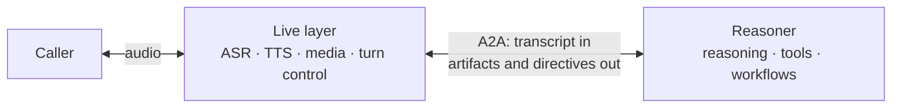

# Agentforce Live A2A Profile Extension

**Status:** Draft v0.1  
**Extension URI:** `https://schemas.salesforce.com/a2a/ext/agentforce-live/v0.1`

## 1. Purpose and scope

This document specifies an optional [Agent2Agent (A2A)](https://a2a-protocol.org/)
profile for real-time, steerable conversations between a **Live layer** and a
**Reasoner**.

The Live layer is the fast, media-facing A2A client: it owns the caller
connection, ASR, TTS, turn-taking, and interruption handling. The Reasoner is the
slow-thinking A2A server: it reasons, invokes tools and workflows, and produces
output and directives that steer the Live layer.

The v0.1 boundary is **text in; text and directives out**. Audio and video bytes do
not cross this A2A boundary. The profile uses existing A2A messages, task states,
artifacts, status updates, metadata, and data parts; it defines no new RPC methods
or task states.



## 2. Normative language

The key words **MUST**, **MUST NOT**, **SHOULD**, **SHOULD NOT**, and **MAY** are
to be interpreted as described by RFC 2119 and RFC 8174.

## 3. A2A mapping

| Conversational concept | A2A representation |
| --- | --- |
| Call or session | `contextId` |
| User turn | One `Task` / `taskId` |
| User transcript | `ROLE_USER` `Message` with a `TextPart` |
| Spoken response | `TaskArtifactUpdateEvent` artifact chunks |
| Conversation control | `TaskStatusUpdateEvent` with a profile `DataPart` |
| End of a normal turn | Terminal `COMPLETED` state |
| Barge-in | `tasks/cancel` plus an `interruption` profile message |

A new message with no `contextId` begins a session; the Reasoner creates and
returns the `contextId`. A message with an existing `contextId` continues that
session. Each final ASR utterance starts a new task under the session, except that
input collected for an `INPUT_REQUIRED` task continues the same `taskId`.

The Live layer SHOULD provide these correlation identifiers in metadata:

| Identifier | Metadata key | Purpose |
| --- | --- | --- |
| Turn | `afl/turnId` | Mirrors `taskId` for simple joins |
| Interaction | `afl/interactionId` | Per-turn analytics key; echoed by the Reasoner |
| Request chunk | `afl/requestGuid` | Chunk-level correlation |

## 4. Discovery, transport, and activation

The Reasoner MUST publish an Agent Card at `/.well-known/agent-card.json`. It
MUST advertise this extension under `capabilities.extensions` and SHOULD offer a
session-scoped, full-duplex WebSocket JSON-RPC interface. HTTP/SSE and gRPC MAY be
offered as compatible fallback bindings.

```json
{
  "name": "ExampleReasoner",
  "version": "0.1.0",
  "url": "wss://reasoner.example.com/a2a/v0.1/{agentId}",
  "preferredTransport": "json-rpc-2.0-websocket",
  "capabilities": {
    "streaming": true,
    "extensions": [{
      "uri": "https://schemas.salesforce.com/a2a/ext/agentforce-live/v0.1",
      "description": "Realtime conversation directives",
      "required": false,
      "params": {
        "directiveTypes": [
          "say_exactly", "convey", "ask_for", "confirm_entities",
          "progress", "escalate", "end_session"
        ]
      }
    }]
  }
}
```

Agent Card transport field names vary among A2A revisions: implementations using
the current shape SHOULD use `supportedInterfaces`; implementations targeting A2A
0.3 MAY use `preferredTransport` and `additionalInterfaces`. The selected A2A
baseline MUST be stated by the implementation.

### 4.1 Extension negotiation

The client requests this extension in the `A2A-Extensions` header during the
WebSocket upgrade (or on the first request for another binding). The server echoes
the subset it activates in its `A2A-Extensions` response header. Some A2A 0.3
implementations use the compatibility spelling `X-A2A-Extensions`.

An echoed URI means the extension is active for the session. If it is not echoed,
the client MUST use the fallback behavior in section 9. The extension is optional:
Agent Cards MUST set `required` to `false` for v0.1.

### 4.2 Client directive capabilities

The Agent Card lists directive types the Reasoner can emit. A Live layer MAY
declare a narrower supported set immediately after activation with a `ROLE_USER`
message tagged `clientCapabilities`:

```json
{
  "role": "ROLE_USER",
  "metadata": {
    "https://schemas.salesforce.com/a2a/ext/agentforce-live/v0.1/eventType": "clientCapabilities"
  },
  "parts": [{
    "data": { "directiveTypes": ["say_exactly", "convey", "progress", "end_session"] }
  }]
}
```

The effective directive set is the intersection of the Agent Card list and this
client list. The Reasoner MUST emit only effective types. If no capability message
is sent, it MAY assume the client supports the full Agent Card list. When a needed
directive is unsupported, the Reasoner SHOULD express the result through a
supported conversational output where possible; otherwise it MUST fail the task.

## 5. Profile envelope and ordering

All profile-specific payloads use the extension URI as a metadata-key prefix. In
examples, `afl/` abbreviates
`https://schemas.salesforce.com/a2a/ext/agentforce-live/v0.1/`.

| Metadata key | Required on | Meaning |
| --- | --- | --- |
| `afl/eventType` | Profile messages/events | `directive`, `interruption`, `conversationHistoryUpdate`, or `clientCapabilities` |
| `afl/directiveType` | Directive events | Directive name from the negotiated set |
| `afl/sequenceId` | Directive artifacts and status events | Monotonic, turn-scoped ordering key |
| `afl/textForm` | Spoken `TextPart` | `normalized` or `transcript` |
| `afl/renderMode` | Spoken directive `TextPart` | `verbatim` or `paraphrase` |

The Reasoner MUST assign a monotonic `afl/sequenceId` to every directive event.
The Live layer MUST order artifacts and status events for the same turn by that
value, rather than assuming that separate A2A event channels preserve a shared
order.

## 6. Turn input and output

### 6.1 User turn

The Live layer sends an ASR-final transcript as `message/stream`, using a
`ROLE_USER` `Message` containing a `TextPart`. It MUST NOT send audio bytes under
this profile. A message without a task ID starts a turn task; the returned task ID
is the identifier for that turn.

### 6.2 Spoken output

The Reasoner streams user-facing output as `TaskArtifactUpdateEvent` events. One
artifact represents one response. Non-final chunks use `append: true`; the final
chunk sets `lastChunk: true`.

Each spoken chunk SHOULD contain both:

* a `TextPart` tagged `afl/textForm=normalized`, optimized for TTS; and
* a `TextPart` tagged `afl/textForm=transcript`, suitable for history and UI.

An untagged text part is interpreted as transcript. Artifacts or parts SHOULD also
carry sequence and timestamp metadata.

After final output, the Reasoner MUST emit terminal `COMPLETED` for an ordinary
completed turn. Reaching a terminal A2A state—not an SDK-specific `final` flag—is
the end-of-turn signal.

## 7. Directives

Every directive is an `afl/eventType=directive` payload and MUST have
`afl/directiveType` and `afl/sequenceId` metadata. Its channel is determined by
its purpose:

| Directive | A2A channel and state | Meaning |
| --- | --- | --- |
| `say_exactly` | Artifact; `renderMode=verbatim` | Speak supplied text exactly |
| `convey` | Artifact; `renderMode=paraphrase` | Express supplied idea in local conversational context |
| `ask_for` | Status; `INPUT_REQUIRED` | Collect structured information, then resume the task |
| `confirm_entities` | Status; `INPUT_REQUIRED` | Confirm sensitive/destructive-action details, then resume |
| `progress` | Status; remains `WORKING` | Play status/filler while reasoning continues |
| `escalate` | Status; terminal `COMPLETED` | Transfer to a human, agent, or flow |
| `end_session` | Status; terminal `COMPLETED` | Speak final text and close the session |

`COMPLETED` without a terminal directive is ordinary turn completion. It MUST NOT
be treated as `end_session`.

### 7.1 Handoff directives

An `ask_for` or `confirm_entities` status event MUST set the task state to
`INPUT_REQUIRED` and include a `DataPart` describing requested fields or entities,
validators, cancellation behavior, and the response schema. The Live layer owns
the resulting short dialogue. It resumes Reasoner work by sending a `ROLE_USER`
message containing the collected structured data on the same `contextId` and
`taskId`; the Reasoner then returns to `WORKING`.

`confirm_entities` supports a two-phase confirmation before a sensitive or
destructive operation. The Reasoner owns idempotent resumption; the Live layer owns
reprompts and caller interaction during the handoff.

### 7.2 Progress, failure, and terminal directives

A `progress` directive remains `WORKING` and carries a `DataPart` with
`progressIndicatorType`, `text`, and `timestamp`.

Failures MUST use the core `FAILED` state. `status.message` SHOULD supply a stable
error code and a safe human-readable message. Escalation after repeated failures is
a client policy, not a protocol feature.

`end_session` MUST provide `reason`, `text`, `normalized_text`, and
`transcript_text`. Permitted reasons are `CLOSED_USER_REQUEST`, `CLOSED_ACTION`,
`CLOSED_TRANSFERRED`, `EXPIRED`, `ERROR`, and `UNSPECIFIED`. The Live layer speaks
the final text and closes the call/session.

For `escalate`, the Reasoner MUST provide a caller-facing message and an
implementation-neutral reason. Queue IDs, flow IDs, SIP endpoints, and other
routing details are deployment-specific and MUST NOT be required by this profile.
The Live layer performs the transfer and reports its outcome in its next
`ROLE_USER` message so the Reasoner can end or replan.

## 8. Interruption and history backfill

On barge-in, the Live layer MUST send `tasks/cancel` for the in-flight task and
MUST send an `afl/eventType=interruption` `DataPart` containing:

```json
{
  "played_text": "text heard by the caller",
  "planned_text": "full planned response",
  "unspoken_text": "remaining response",
  "interrupted_turn_id": "<taskId>",
  "interrupted_request_guid": "<requestGuid>"
}
```

The task transitions to `CANCELED`. The next utterance begins a new task under the
same context; v0.1 uses this roll-forward model and does not roll back partial work.

The Live layer is authoritative for what the caller actually heard. It MAY send a
`ROLE_USER` `conversationHistoryUpdate` `DataPart` to backfill a locally handled
turn or an interrupted response. The payload contains `turn_id`, `started_at`,
`completed_at`, `messages`, `source`, and `topic`; a truncated response records
its played and unspoken portions.

## 9. Interoperability and graceful degradation

The profile is additive. If the extension is inactive or unknown, both sides MUST
continue using core A2A:

* A profile-aware Live layer consuming a vanilla Reasoner converts ordinary text
  artifacts/messages to TTS and relies on core states.
* A vanilla Live layer consuming a profile-aware Reasoner ignores unknown profile
  metadata, consumes text output, and follows core states.

In degraded mode there are no profile directives, explicit conversational lease
handoff, distinct escalation, or explicit end-session action. `COMPLETED` and
`INPUT_REQUIRED` remain usable as core A2A states.

## 10. Security and implementation requirements

Implementations MUST use the Agent Card's declared A2A authentication scheme and
MUST protect WebSocket connections with TLS (`wss`). They SHOULD validate extension
activation before interpreting profile data, validate directive schemas and field
values, bound message and artifact sizes, enforce authorization for handoff and
transfer actions, and avoid placing sensitive caller data in logs or telemetry.

Implementations SHOULD define replay/idempotency behavior using the context, task,
interaction, and request identifiers in section 3.

## 11. Out of scope for v0.1

* Media-carrying A2A (audio/video across this boundary).
* A normative escalation routing-target schema and transfer-result handshake.
* Graceful connection drain, buffering, reconnect, and replay. A future extension
  may define `draining` and `endOfConnection` events, resumability fields, and
  recovery through `tasks/resubscribe` while preserving `contextId`.
